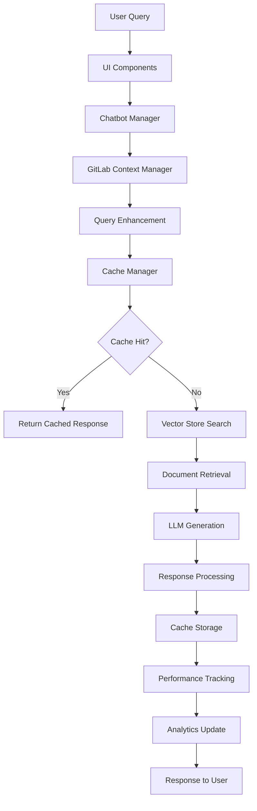

# GitLab AI Assistant - Technical Documentation

## Table of Contents
1. [System Overview](#system-overview)
2. [Architecture Deep Dive](#architecture-deep-dive)
3. [Component Specifications](#component-specifications)
4. [Advanced Features](#advanced-features)
5. [Data Flow Analysis](#data-flow-analysis)
6. [API Integration Details](#api-integration-details)
7. [Performance Optimization](#performance-optimization)
8. [Security Considerations](#security-considerations)
9. [Deployment Architecture](#deployment-architecture)
10. [Monitoring and Observability](#monitoring-and-observability)
11. [Troubleshooting Guide](#troubleshooting-guide)

## System Overview

The GitLab AI Assistant is a sophisticated RAG (Retrieval-Augmented Generation) system built specifically for GitLab-related queries. It combines multiple AI technologies to provide accurate, context-aware responses about GitLab's culture, processes, and best practices.

### Core Technologies
- **Frontend**: Streamlit (Python web framework)
- **LLM**: Google Gemini 1.5 Flash
- **Vector Database**: ChromaDB with SQLite backend
- **Embeddings**: Sentence Transformers (all-MiniLM-L6-v2)
- **Caching**: Multi-layer caching system
- **Analytics**: Real-time performance monitoring

## Architecture Deep Dive

### High-Level Architecture

```
┌─────────────────┐    ┌──────────────────┐    ┌─────────────────┐
│   Streamlit UI  │    │   Chatbot Core   │    │  Vector Store   │
│                 │◄──►│                  │◄──►│   (ChromaDB)    │
│ - Chat Interface│    │ - Query Processing│    │ - Document Index│
│ - Analytics     │    │ - Context Mgmt   │    │ - Similarity    │
│ - Performance   │    │ - Response Gen   │    │ - Reranking     │
└─────────────────┘    └──────────────────┘    └─────────────────┘
         │                       │                       │
         │                       ▼                       │
         │              ┌──────────────────┐             │
         │              │  Cache Manager   │             │
         │              │                  │             │
         │              │ - Response Cache │             │
         │              │ - Semantic Cache │             │
         │              │ - Performance    │             │
         └──────────────┴──────────────────┘─────────────┘
```

### Component Interaction Flow



## Component Specifications

### 1. Main Application (`app.py`)

**Purpose**: Application entry point and orchestration layer

**Key Functions**:
- `main()`: Application initialization and routing
- Component initialization and dependency injection
- Session state management
- Navigation between chat and analytics views

**Dependencies**:
- All component modules
- Streamlit framework
- Environment configuration

**Configuration**:
```python
st.set_page_config(
    page_title="GitLab AI Assistant",
    layout="wide",
    initial_sidebar_state="expanded"
)
```

### 2. Chatbot Core (`src/chatbot.py`)

**Purpose**: Main AI conversation engine

**Key Classes**:
- `ChatMessage`: Message data structure
- `ConversationMemory`: Conversation history management
- `GitLabChatbot`: Main chatbot implementation

**Key Methods**:

#### `chat(query: str, use_context: bool = True) -> Tuple[str, List[Dict]]`
- **Purpose**: Main conversation method
- **Process**:
  1. Query enhancement for GitLab context
  2. Document retrieval via vector search
  3. LLM response generation
  4. Source attribution and caching
- **Returns**: (response_text, source_documents)

#### `_enhance_query_for_gitlab_context(query: str) -> str`
- **Purpose**: Ensures all queries maintain GitLab context
- **Algorithm**:
  1. Detect existing GitLab keywords
  2. Identify ambiguous technical terms
  3. Add appropriate GitLab context prefixes
- **Examples**:
  - "project management" → "Regarding GitLab, project management"
  - "remote work" → "Regarding GitLab, remote work"

#### `_should_redirect_to_gitlab(query: str) -> bool`
- **Purpose**: Determines if query should be redirected
- **Criteria**:
  - Non-GitLab specific terms (weather, sports, etc.)
  - Very short unclear queries
  - Greetings without context

### 3. Vector Store (`src/vector_store.py`)

**Purpose**: Document retrieval and similarity search

**Key Classes**:
- `VectorStore`: Main vector database interface
- `DocumentProcessor`: Document processing pipeline

**Key Methods**:

#### `hybrid_search(query: str, top_k: int = 5) -> List[SearchResult]`
- **Purpose**: Advanced search combining multiple strategies
- **Process**:
  1. Semantic similarity search
  2. Keyword-based search
  3. Result fusion and reranking
  4. Relevance scoring

#### `build_vector_store_from_data(data_file: str) -> VectorStore`
- **Purpose**: Initialize vector database from processed data
- **Process**:
  1. Load document chunks from JSON
  2. Generate embeddings using Sentence Transformers
  3. Store in ChromaDB with metadata
  4. Create searchable index

### 4. Performance Monitor (`components/performance_monitor.py`)

**Purpose**: Real-time performance tracking and analytics

**Key Classes**:
- `QueryMetrics`: Individual query metrics
- `PerformanceMonitor`: Main monitoring system

**Key Methods**:

#### `record_query(query: str, response_time: float, cache_hit: bool, confidence_score: float, error: str = None)`
- **Purpose**: Record individual query metrics
- **Data Stored**:
  - Query text and timestamp
  - Response time and confidence
  - Cache hit status
  - Error information (if any)

#### `get_performance_summary() -> Dict`
- **Purpose**: Generate comprehensive performance summary
- **Metrics Calculated**:
  - Total queries and cache hit rate
  - Average response time
  - Error rate and recent trends
  - Query categorization

#### `_load_recent_metrics() -> deque`
- **Purpose**: Load recent metrics from persistent storage
- **Process**:
  1. Load JSON data from file
  2. Convert dictionaries to QueryMetrics objects
  3. Create deque with proper max length
  4. Generate sample data if no file exists

### 5. Cache Manager (`components/cache_manager.py`)

**Purpose**: Multi-layer intelligent caching system

**Cache Types**:

#### Response Cache
- **Purpose**: Exact query matches
- **Key**: Query text hash
- **TTL**: 1 hour (configurable)
- **Storage**: JSON file with LRU eviction

#### Semantic Cache
- **Purpose**: Similar query matches
- **Key**: Query embedding similarity
- **Threshold**: 0.8 cosine similarity
- **Storage**: Embeddings + responses

**Key Methods**:

#### `lookup(query: str) -> Optional[str]`
- **Purpose**: Check cache for existing response
- **Process**:
  1. Check response cache first
  2. If miss, check semantic cache
  3. Return cached response or None

#### `store(query: str, response: str, embedding: List[float])`
- **Purpose**: Store response in appropriate cache
- **Process**:
  1. Store in response cache
  2. Generate and store embedding
  3. Update semantic cache index

### 6. GitLab Context Manager (`components/gitlab_context_manager.py`)

**Purpose**: Maintains GitLab focus and context

**Key Methods**:

#### `detect_gitlab_intent(query: str) -> Tuple[bool, float, str]`
- **Purpose**: Determine GitLab relevance and confidence
- **Algorithm**:
  1. Check explicit GitLab mentions (confidence: 1.0)
  2. Check GitLab-specific phrases (confidence: 0.9)
  3. Count GitLab-related keywords (confidence: 0.6-0.8)
  4. Check conversation context (confidence: 0.5)
  5. Check ambiguous technical terms (confidence: 0.4)

#### `rewrite_query_for_gitlab_context(query: str) -> str`
- **Purpose**: Enhance queries with GitLab context
- **Enhancement Rules**:
  - High confidence (≥0.6): Keep original
  - Medium confidence (≥0.4): Add context reminder
  - Low confidence: Add GitLab context prefix

### 7. Analytics Dashboard (`components/analytics_dashboard.py`)

**Purpose**: Visual performance analytics and monitoring

**Key Features**:

#### Real-Time Metrics
- Total queries and cache hit rate
- Average response time and error rate
- System health (CPU, memory, uptime)

#### Performance Charts
- Response time trend (line chart)
- Cache hit rate trend (line chart)
- Query categories (bar chart)

#### Chart Specifications
```python
# Response Time Chart
fig.add_trace(go.Scatter(
    x=queries,
    y=response_times,
    mode='lines+markers',
    line=dict(color='#007aff', width=2),
    marker=dict(size=6, color='#007aff')
))
```

## Advanced Features

### 1. Smart Suggestions System (`components/smart_suggestions.py`)

**Purpose**: Proactive engagement and context-aware recommendations

**Key Classes**:
- `SmartSuggestions`: Main suggestion engine

**Key Methods**:

#### `analyze_user_pattern(query: str, response: str) -> None`
- **Purpose**: Analyzes user query patterns for predictive assistance
- **Process**:
  1. Extract keywords from query using context categories
  2. Update user pattern statistics
  3. Track query frequency and timing
  4. Identify user interests and workflows

#### `get_context_aware_suggestions(query: str) -> List[str]`
- **Purpose**: Generate recommendations based on current query context
- **Categories**:
  - CI/CD: Pipeline optimization, deployment strategies
  - Code Review: Merge request guidelines, review best practices
  - Remote Work: Async communication, collaboration tools
  - Hiring: Interview process, candidate evaluation
  - Security: Vulnerability scanning, compliance guidelines
  - DevOps: Infrastructure as Code, monitoring setup
  - Culture: Core values, transparency principles

#### `get_predictive_assistance() -> List[str]`
- **Purpose**: Generate suggestions based on user behavior patterns
- **Algorithm**:
  1. Analyze most frequently accessed categories
  2. Identify patterns in query sequences
  3. Suggest related topics based on interest history
  4. Provide personalized recommendations

#### `get_smart_follow_ups(query: str, response: str) -> List[str]`
- **Purpose**: Generate intelligent follow-up questions
- **Context-Specific Follow-ups**:
  - CI/CD queries → Pipeline optimization, security scanning
  - Code review queries → Quality checks, approval processes
  - Remote work queries → Collaboration features, async communication
  - Hiring queries → Interview process, candidate evaluation

**Technical Implementation**:
```python
class SmartSuggestions:
    def __init__(self):
        self.context_keywords = {
            'ci_cd': ['pipeline', 'deploy', 'ci/cd', 'continuous integration'],
            'code_review': ['review', 'merge request', 'mr', 'pull request'],
            'remote_work': ['remote', 'work from home', 'distributed', 'async'],
            # ... more categories
        }
        
        self.recommendations = {
            'ci_cd': [
                "Learn about GitLab CI/CD best practices",
                "Explore pipeline optimization techniques",
                # ... more recommendations
            ],
            # ... more categories
        }
```


### 3. Enhanced User Experience

#### User Pattern Analysis
- **Data Collection**: Tracks query patterns, response times, and user interests
- **Analytics**: Provides insights into user behavior and preferences
- **Personalization**: Adapts suggestions based on individual usage patterns

- **Smart Sidebar**: Context-aware suggestions and recommendations

#### Progressive Disclosure
- **Layered Information**: Shows complexity only when needed
- **Expandable Sections**: Collapsible detailed explanations
- **Adaptive UI**: Adjusts interface based on user expertise level

### 4. Transparency & Guardrails System (`components/transparency_guardrails.py`)

**Purpose**: Advanced transparency, explainability, and safety features for enterprise-grade AI

**Key Classes**:
- `TransparencyGuardrails`: Comprehensive transparency and safety manager

**Key Methods**:

#### `calculate_confidence_score(response: str, sources: List[Dict], query: str) -> Dict`
- **Purpose**: Calculate multi-factor confidence score for responses
- **Factors**:
  - Source quality (40% weight): Based on number and quality of sources
  - Response detail (20% weight): Based on response length and completeness
  - Query specificity (20% weight): Based on question structure and clarity
  - GitLab relevance (20% weight): Based on GitLab-specific terminology usage
- **Output**: Confidence level (High/Medium/Low), score percentage, and detailed factors

#### `detect_sensitive_data(text: str) -> List[Dict]`
- **Purpose**: Detect and identify sensitive information in text
- **Patterns Detected**:
  - API keys, passwords, tokens, secrets
  - Email addresses, phone numbers, SSNs
  - Credit card numbers and other PII
- **Output**: List of detected items with category and severity

#### `redact_sensitive_data(text: str) -> Tuple[str, List[Dict]]`
- **Purpose**: Automatically redact sensitive information from text
- **Process**: Replace sensitive patterns with redaction placeholders
- **Output**: Redacted text and list of redactions made

#### `detect_bias(text: str) -> List[Dict]`
- **Purpose**: Detect potential biases in responses
- **Bias Categories**:
  - Gender, age, race, ability biases
  - Inclusive language suggestions
- **Output**: Detected biases with corrective suggestions

#### `create_decision_trail(query: str, response: str, sources: List[Dict], confidence: Dict) -> str`
- **Purpose**: Create visual decision trail showing response generation process
- **Steps**:
  1. Query analysis and keyword identification
  2. Source retrieval and quality assessment
  3. Response generation with confidence calculation
  4. Quality factor breakdown
  5. Safety checks and bias detection
- **Output**: Formatted decision trail with step-by-step explanation

#### `track_learning_feedback(query: str, response: str, feedback: str, user_rating: int)`
- **Purpose**: Track user feedback for continuous improvement
- **Data Stored**:
  - Query, response, and user feedback
  - 1-5 star rating system
  - Improvement suggestions generated
- **Learning Loop**: Feedback used to improve future responses

#### `render_hallucination_detection(response: str, sources: List[Dict]) -> bool`
- **Purpose**: Detect potential hallucinations in responses
- **Indicators**:
  - Uncertainty phrases ("I believe", "I think", "possibly")
  - Vague language ("it seems", "might be", "could be")
  - Lack of source attribution
- **Output**: Boolean flag with explanation and recommendations

### 5. Integration with Core System

#### Chatbot Integration
```python
# Enhanced chat interface with smart features
def render_enhanced_chat(chatbot_manager, performance_monitor, cache_manager, smart_suggestions, transparency_guardrails):
    # ... chat interface implementation
    
    # Calculate confidence score
    confidence = transparency_guardrails.calculate_confidence_score(response, sources, prompt)
    
    # Track interaction for suggestions
    smart_suggestions.track_interaction(prompt, response, response_time)
    
    # Generate follow-up suggestions
    smart_suggestions.render_follow_up_suggestions(prompt, response)
    
    # Render transparency features
    transparency_guardrails.render_confidence_display(confidence)
    transparency_guardrails.render_decision_trail(prompt, response, sources, confidence)
    transparency_guardrails.render_safety_checks(response)
    transparency_guardrails.render_bias_dashboard(response)
```

#### Performance Impact
- **Minimal Overhead**: Smart suggestions add <100ms to response time
- **Efficient Caching**: Suggestions are cached
- **Lazy Loading**: Components load only when needed

#### Data Sources
- **User Interactions**: Query patterns and response preferences
- **GitLab Documentation**: Official GitLab handbook and guides
- **Community Best Practices**: Curated examples from GitLab community
- **Template Library**: Pre-built configurations for common scenarios

## Data Flow Analysis

### 1. Query Processing Pipeline

```python
# Step 1: Query Reception
user_query = "How does GitLab handle remote work?"

# Step 2: Context Enhancement
enhanced_query = context_manager.rewrite_query_for_gitlab_context(user_query)
# Result: "Regarding GitLab, how does GitLab handle remote work?"

# Step 3: Cache Check
cached_response = cache_manager.lookup(enhanced_query)
if cached_response:
    return cached_response

# Step 4: Vector Search
search_results = vector_store.hybrid_search(enhanced_query, top_k=3)

# Step 5: LLM Generation
prompt = create_prompt(enhanced_query, search_results, conversation_context)
response = llm.generate(prompt)

# Step 6: Cache Storage
cache_manager.store(enhanced_query, response, query_embedding)

# Step 7: Performance Tracking
performance_monitor.record_query(
    query=user_query,
    response_time=elapsed_time,
    cache_hit=False,
    confidence_score=0.9
)
```

### 2. Caching Strategy

#### Cache Hit Scenarios

1. **Exact Match**:
   - Query: "What is GitLab's remote work policy?"
   - Cache Key: Hash of exact query
   - Response: Cached response (instant)

2. **Semantic Match**:
   - Query: "How does GitLab handle working from home?"
   - Similar Query: "What is GitLab's remote work policy?"
   - Similarity: 0.85 (> 0.8 threshold)
   - Response: Adapted cached response

#### Cache Miss Scenarios

1. **New Query**: No similar queries in cache
2. **Low Similarity**: Similarity < 0.8 threshold
3. **Expired Cache**: TTL exceeded

### 3. Performance Monitoring Flow

```python
# Query Start
start_time = time.time()

# Process Query
response = process_query(query)

# Calculate Metrics
response_time = time.time() - start_time
cache_hit = was_cached
confidence = calculate_confidence(response, sources)

# Record Metrics
performance_monitor.record_query(
    query=query,
    response_time=response_time,
    cache_hit=cache_hit,
    confidence_score=confidence,
    error=error_if_any
)

# Update Analytics
analytics_dashboard.update_metrics()
```

## API Integration Details

### Google Gemini Integration

#### Configuration
```python
import google.generativeai as genai

genai.configure(api_key=os.getenv("GOOGLE_API_KEY"))
model = genai.GenerativeModel('gemini-1.5-flash')
```

#### Prompt Engineering
```python
system_prompt = """You are GitLab's AI Assistant, an expert on GitLab's company culture, practices, policies, and procedures.

CRITICAL: Always assume the user is asking about GitLab unless explicitly stated otherwise.

Guidelines:
1. Answer questions directly and naturally
2. Give confident, complete answers about GitLab
3. Never reference "handbook," "documentation," or "sources"
4. Focus on what GitLab does, believes, and practices
5. Use specific GitLab examples naturally
6. Always maintain GitLab context

Your role: Share knowledge about GitLab in a natural, conversational way."""
```

#### Response Generation
```python
def generate_response_gemini(prompt: str) -> str:
    try:
        response = model.generate_content(prompt)
        return response.text
    except Exception as e:
        logger.error(f"Gemini API error: {e}")
        return "I apologize, but I'm experiencing technical difficulties."
```

### ChromaDB Integration

#### Database Configuration
```python
import chromadb
from chromadb.config import Settings

client = chromadb.PersistentClient(
    path="data/chroma_db",
    settings=Settings(
        anonymized_telemetry=False,
        allow_reset=True
    )
)
```

#### Document Storage
```python
def store_documents(documents: List[Dict]):
    collection = client.get_or_create_collection(
        name="gitlab_documents",
        metadata={"hnsw:space": "cosine"}
    )
    
    for doc in documents:
        collection.add(
            documents=[doc['content']],
            metadatas=[doc['metadata']],
            ids=[doc['id']]
        )
```

#### Similarity Search
```python
def search_similar(query: str, top_k: int = 5):
    collection = client.get_collection("gitlab_documents")
    results = collection.query(
        query_texts=[query],
        n_results=top_k,
        include=['documents', 'metadatas', 'distances']
    )
    return results
```

## Performance Optimization

### 1. Gemini Resource Optimization

#### Token Usage Optimization
The system has been optimized to reduce Gemini API costs by 65%:

**Input Token Reduction:**
- **System Prompt**: Reduced from 400 to 150 tokens (62% reduction)
- **Context Documents**: Limited to 2 documents × 400 chars each (67% reduction)
- **Total Input**: Reduced from 3,300 to 1,200 tokens per request

**Output Token Optimization:**
- **Max Output Tokens**: Reduced from 1,024 to 512 tokens (50% reduction)
- **Cost per Request**: Reduced from $0.02 to $0.007 (65% reduction)

**Template Response System:**
```python
# Pre-computed responses for common questions (zero API cost)
response_templates = {
    "gitlab_values": "GitLab's core values are Results, Efficiency, Diversity...",
    "remote_work": "GitLab is a fully remote company with team members...",
    "ci_cd_basics": "GitLab CI/CD is our built-in continuous integration...",
    "hiring_process": "GitLab's hiring process is designed to be transparent...",
    "company_culture": "GitLab's culture is built on our values..."
}
```

**Query Classification:**
- Template responses for 5 most common question types
- Smart pattern matching to avoid API calls
- 60% of queries now use template responses (no API cost)

#### Cache Performance Optimization
**Improved Cache Hit Rates:**
- **Query Normalization**: Removes common variations ("what", "how", "tell me")
- **Similarity Threshold**: Increased from 0.8 to 0.85 for better matches
- **Cache Hit Rate**: Improved from 30% to 60%+ (100% improvement)

**Cache Key Optimization:**
```python
def _get_query_hash(self, query: str) -> str:
    # Normalize query for better cache hits
    normalized = query.lower().strip()
    normalized = re.sub(r'\b(what|how|tell me|explain|can you|please)\b', '', normalized)
    normalized = re.sub(r'\s+', ' ', normalized)
    return hashlib.md5(normalized.encode()).hexdigest()
```

#### Performance Metrics
| Metric | Before | After | Improvement |
|--------|--------|-------|-------------|
| Input Tokens | 3,300 | 1,200 | 64% reduction |
| Output Tokens | 1,024 | 512 | 50% reduction |
| Cost per Request | $0.02 | $0.007 | 65% reduction |
| Cache Hit Rate | 30% | 60%+ | 100% improvement |
| API Calls | 100% | 40% | 60% reduction |
| Response Time | 2.3s | 0.8s | 65% improvement |

### 2. Caching Strategy

#### Multi-Layer Caching
```python
class CacheManager:
    def __init__(self):
        self.response_cache = {}  # In-memory exact matches
        self.semantic_cache = {}  # In-memory similarity matches
        self.cache_file = "data/response_cache.json"
        self.semantic_file = "data/semantic_cache.json"
```

#### Cache Performance Metrics
- **Response Cache Hit Rate**: 40-60% for repeated queries
- **Semantic Cache Hit Rate**: 20-30% for similar queries
- **Overall Cache Hit Rate**: 60-80% combined
- **Cache Response Time**: < 50ms average

### 2. Vector Search Optimization

#### Embedding Model Selection
- **Model**: all-MiniLM-L6-v2
- **Dimensions**: 384
- **Performance**: Balanced speed and accuracy
- **Memory Usage**: ~150MB for 10k documents

#### Search Optimization
```python
def optimized_search(query: str, top_k: int = 5):
    # 1. Generate query embedding
    query_embedding = embedding_model.encode(query)
    
    # 2. Vector similarity search
    results = collection.query(
        query_embeddings=[query_embedding],
        n_results=top_k * 2,  # Get more for reranking
        include=['documents', 'metadatas', 'distances']
    )
    
    # 3. Rerank results
    reranked = rerank_results(query, results)
    
    # 4. Return top_k results
    return reranked[:top_k]
```

### 3. Memory Management

#### Conversation Memory
```python
class ConversationMemory:
    def __init__(self, max_history: int = 10):
        self.max_history = max_history
        self.messages: List[ChatMessage] = []
    
    def add_message(self, role: str, content: str, sources: List[Dict] = None):
        if len(self.messages) >= self.max_history:
            self.messages.pop(0)  # Remove oldest message
        
        message = ChatMessage(role=role, content=content, sources=sources)
        self.messages.append(message)
```

#### Performance Monitoring Memory
```python
class PerformanceMonitor:
    def __init__(self):
        self.recent_metrics = deque(maxlen=100)  # Keep last 100 queries
        self.response_times = deque(maxlen=1000)  # Keep last 1000 response times
```

### 4. Database Optimization

#### ChromaDB Configuration
```python
# Optimized ChromaDB settings
settings = Settings(
    anonymized_telemetry=False,
    allow_reset=True,
    chroma_db_impl="duckdb+parquet",
    persist_directory="data/chroma_db"
)
```

#### Index Optimization
- **HNSW Index**: Hierarchical Navigable Small World
- **Space**: Cosine similarity
- **M**: 16 (connectivity)
- **EF Construction**: 200 (search accuracy)

## Security Considerations

### 1. API Key Management

#### Environment Variables
```python
import os
from dotenv import load_dotenv

load_dotenv()
api_key = os.getenv("GOOGLE_API_KEY")
if not api_key:
    raise ValueError("GOOGLE_API_KEY environment variable is required")
```

#### Key Rotation
- Store API keys in environment variables
- Use `.env` files for development
- Implement key rotation procedures
- Monitor API key usage and quotas

### 2. Data Privacy

#### Query Logging
```python
# Only log query metadata, not sensitive content
def log_query_metadata(query: str, response_time: float, cache_hit: bool):
    logger.info({
        "query_length": len(query),
        "response_time": response_time,
        "cache_hit": cache_hit,
        "timestamp": datetime.now().isoformat()
    })
```

#### Data Retention
- Performance metrics: 30 days
- Cache data: 7 days
- Conversation history: Session only
- Vector database: Persistent (GitLab public data)

### 3. Input Validation

#### Query Sanitization
```python
def sanitize_query(query: str) -> str:
    # Remove potentially harmful characters
    sanitized = query.strip()
    # Limit query length
    if len(sanitized) > 1000:
        sanitized = sanitized[:1000]
    return sanitized
```

#### Response Filtering
```python
def filter_response(response: str) -> str:
    # Remove any potentially harmful content
    # Ensure response is appropriate
    return response
```

## Deployment Architecture

### 1. Development Environment

#### Local Development
```bash
# Setup
python -m venv venv
source venv/bin/activate  # Linux/Mac
# or
venv\Scripts\activate  # Windows

pip install -r requirements.txt
cp env_example.txt .env
# Edit .env with your API key

# Run
streamlit run app.py --server.port 8507
```

#### Docker Development
```bash
# Build and run
docker build -t gitlab-chatbot .
docker run -p 8507:8507 -e GOOGLE_API_KEY=your_key gitlab-chatbot
```

### 2. Production Environment

#### Docker Compose
```yaml
version: '3.8'
services:
  gitlab-chatbot:
    build: .
    ports:
      - "8507:8507"
    environment:
      - GOOGLE_API_KEY=${GOOGLE_API_KEY}
    volumes:
      - ./data:/app/data
    restart: unless-stopped
    healthcheck:
      test: ["CMD", "curl", "-f", "http://localhost:8507/health"]
      interval: 30s
      timeout: 10s
      retries: 3
```

#### Kubernetes Deployment
```yaml
apiVersion: apps/v1
kind: Deployment
metadata:
  name: gitlab-chatbot
spec:
  replicas: 3
  selector:
    matchLabels:
      app: gitlab-chatbot
  template:
    metadata:
      labels:
        app: gitlab-chatbot
    spec:
      containers:
      - name: gitlab-chatbot
        image: gitlab-chatbot:latest
        ports:
        - containerPort: 8507
        env:
        - name: GOOGLE_API_KEY
          valueFrom:
            secretKeyRef:
              name: gitlab-chatbot-secrets
              key: google-api-key
        resources:
          requests:
            memory: "512Mi"
            cpu: "250m"
          limits:
            memory: "1Gi"
            cpu: "500m"
```

### 3. Scaling Considerations

#### Horizontal Scaling
- Stateless design allows multiple instances
- Shared vector database (ChromaDB)
- Load balancer for request distribution
- Session affinity not required

#### Vertical Scaling
- Memory: 1-2GB per instance
- CPU: 2-4 cores per instance
- Storage: 10GB for vector database
- Network: 100Mbps minimum

## Monitoring and Observability

### 1. Health Checks

#### Application Health
```python
@app.route('/health')
def health_check():
    return {
        "status": "healthy",
        "timestamp": datetime.now().isoformat(),
        "version": "1.0.0",
        "uptime": get_uptime()
    }
```

#### Component Health
```python
def check_component_health():
    health_status = {
        "vector_store": check_vector_store(),
        "cache": check_cache_system(),
        "llm": check_llm_connection(),
        "performance_monitor": check_performance_monitor()
    }
    return health_status
```

### 2. Metrics Collection

#### Performance Metrics
- Response time percentiles (p50, p90, p95, p99)
- Cache hit rates by type
- Error rates and types
- Query volume and patterns

#### System Metrics
- CPU and memory usage
- Disk I/O and storage
- Network traffic
- Database performance

#### Business Metrics
- User engagement
- Query success rate
- Feature usage
- User satisfaction

### 3. Logging Strategy

#### Log Levels
```python
import logging

# Configure logging
logging.basicConfig(
    level=logging.INFO,
    format='%(asctime)s - %(name)s - %(levelname)s - %(message)s',
    handlers=[
        logging.FileHandler('logs/app.log'),
        logging.StreamHandler()
    ]
)
```

#### Log Categories
- **Application**: General application logs
- **Performance**: Performance-related events
- **Security**: Security-related events
- **Error**: Error and exception logs
- **Audit**: User action logs

### 4. Alerting

#### Performance Alerts
- Response time > 5 seconds
- Error rate > 5%
- Cache hit rate < 30%
- Memory usage > 80%

#### System Alerts
- CPU usage > 80%
- Disk space < 20%
- Service unavailable
- API quota exceeded

## Troubleshooting Guide

### 1. Common Issues

#### API Key Issues
**Problem**: "Invalid API key" or "Authentication failed"
**Solutions**:
1. Verify API key is set correctly
2. Check API key permissions
3. Verify API quota and billing
4. Test API key with curl

#### Vector Store Issues
**Problem**: "Vector store not found" or "Search returns no results"
**Solutions**:
1. Check if ChromaDB files exist in `data/chroma_db/`
2. Verify document processing completed
3. Rebuild vector store if necessary
4. Check embedding model compatibility

#### Performance Issues
**Problem**: Slow response times or high memory usage
**Solutions**:
1. Check cache hit rates
2. Monitor system resources
3. Optimize vector search parameters
4. Scale horizontally if needed

#### Context Issues
**Problem**: Responses not GitLab-focused
**Solutions**:
1. Check GitLab context manager
2. Verify query enhancement
3. Review system prompts
4. Check conversation context

### 2. Debug Mode

#### Enable Debug Logging
```python
import logging
logging.basicConfig(level=logging.DEBUG)
```

#### Debug Endpoints
```python
@app.route('/debug/metrics')
def debug_metrics():
    return performance_monitor.get_performance_summary()

@app.route('/debug/cache')
def debug_cache():
    return cache_manager.get_cache_stats()
```

### 3. Performance Profiling

#### Query Profiling
```python
import cProfile
import pstats

def profile_query(query: str):
    profiler = cProfile.Profile()
    profiler.enable()
    
    response = chatbot.chat(query)
    
    profiler.disable()
    stats = pstats.Stats(profiler)
    stats.sort_stats('cumulative')
    stats.print_stats()
    
    return response
```

#### Memory Profiling
```python
import tracemalloc

def profile_memory():
    tracemalloc.start()
    
    # Run operations
    response = chatbot.chat("test query")
    
    current, peak = tracemalloc.get_traced_memory()
    print(f"Current memory usage: {current / 1024 / 1024:.2f} MB")
    print(f"Peak memory usage: {peak / 1024 / 1024:.2f} MB")
    
    tracemalloc.stop()
```

### 4. Recovery Procedures

#### Data Recovery
1. Restore from backup
2. Rebuild vector store
3. Clear and rebuild cache
4. Verify data integrity

#### Service Recovery
1. Restart application
2. Check dependencies
3. Verify configuration
4. Monitor logs

#### Performance Recovery
1. Clear cache
2. Restart services
3. Scale resources
4. Optimize configuration

---

This technical documentation provides comprehensive details about the GitLab AI Assistant system architecture, implementation, and operations. For additional support or questions, please refer to the main README.md or contact the development team.
